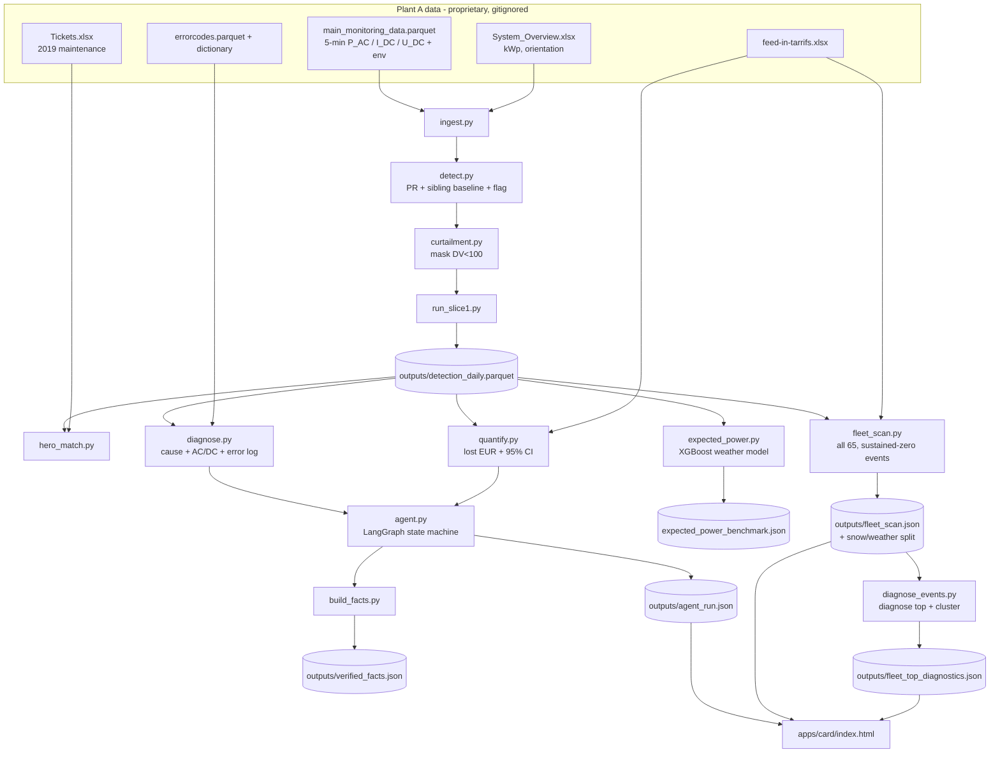

# Architecture

A deterministic analytics pipeline over the plant's SCADA feed, wrapped by an
auditable agent. Every number a human sees is computed in Python from telemetry;
the only language model in the system is the optional chat explainer. The whole
chain is replayable: the same inputs always produce the same trace and the same
euros.

## Data flow



Artifacts in `outputs/` are regenerable (and gitignored); the frozen canonical copies
the card renders live in `demo_frozen/` and `apps/card/` (tracked).

## Modules

**ingest.py** - in: native monitoring parquet (CSV fallback) + `System_Overview.xlsx`.
Builds a typed DuckDB cache (off-disk) and the `mon_wide` / `mon_env` / `mon_long`
views (timestamp, inverter_id, p_ac, i_dc, u_dc + shared env tracks). Parses kWp and
orientation per inverter. Out: DuckDB views + `DataFrame[inverter_id, kwp, orientation]`.

**detect.py** - in: the mon_* views + meta. Computes interval Performance Ratio
(IEC 61724: `PR = P_AC / (kWp * G/1000)`), aggregates to one row per inverter-day,
then a sibling baseline = median PR across same-date, same-orientation inverters.
Flags a day when an inverter's PR is > 7 percentage points below its siblings.
Out: daily DataFrame (pr, daily_kwh, sibling_pr, residual, flagged).

**curtailment.py** - in: the daily DataFrame. Classifies each inverter-day as
`fault | curtailment | ok`. A day is `curtailment` when more than 20% of daytime
intervals show the plant DV setpoint below 100 (grid/market throttle). Curtailment
overrides fault, so a throttle is never scored as an inverter failure.

**hero_match.py** - in: daily detections + `Tickets.xlsx`. For each 2019 inverter
ticket, finds inverters with a run of >= 3 consecutive non-curtailed fault days that
overlaps the ticket window, and ranks candidates. This is the precision check: a
detection that lines up with a real maintenance record is ground truth.

**diagnose.py** - in: the monitoring cache + error-code parquet/dictionary. Returns a
`CauseVerdict` (Pydantic): primary cause, AC/DC side, confidence, evidence list, the
DC rails (`u_dc_v`, `i_dc_a`, `u_dc_healthy_v`), and an error-code corroboration string.
Named rules in priority order: curtailment guard -> dead-inverter (AC vs DC from the DC
rails) -> soiling (`rdtools.soiling_srr`, Deceglie 2018) -> clipping
(`rdtools.clip_filter`, Perry 2021) -> thermal -> unknown.

**quantify.py** - in: `detection_daily.parquet` + `feed-in-tarrifs.xlsx`. Returns a
`LossEstimate`: lost kWh and EUR with a 95% interval and the method used. Primary path
is CausalImpact (Brodersen 2015 BSTS, controls = best-correlated healthy siblings);
when TensorFlow is unavailable it uses the documented deterministic `sibling_sigma`
fallback (expected = sibling median PR * kWp * insolation; lost = expected - actual;
band from the pre-period residual sigma). The tariff is read from the file, never assumed.

**expected_power.py** - in: clean (IEA PVPS Task 13 filtered) rows for an inverter.
Trains an XGBoost regressor of power vs irradiance/temperature/sun-altitude, validates
on a held-out clean window, then prices the outage as predicted minus actual. An
**independent** second estimate of the same loss, never in the agent decision path.
Out: `ExpectedPowerResult` + the benchmark JSON.

**agent.py** - in: an inverter id + window. A LangGraph `StateGraph` orchestrates the
tools: observe -> triage -> diagnose -> quantify -> act, with two conditional exits
(healthy, curtailment). Routing is plain deterministic Python over typed tool outputs;
no LLM is in the loop. Emits a typed, append-only trace to `outputs/agent_run.json`.

**build_facts.py** - assembles `outputs/verified_facts.json`. A validate-before-show
gate asserts every emitted number equals its computed source before it can reach any
narration/UI layer.

**fleet_scan.py** - in: `detection_daily.parquet` + tariff. Runs the same detection
across all 65 inverters, extracts sustained-zero outage events, prices each with the
**same deterministic sibling counterfactual** `quantify` uses (not CausalImpact, for
speed and determinism), aggregates, and adds the snow/weather split. Out:
`outputs/fleet_scan.json`.

**diagnose_events.py** - in: `fleet_scan.json`. Runs `diagnose.diagnose()` on the top-N
events, derives a SIGNAL (DEAD_INVERTER vs POSSIBLE_OFFLINE vs REVIEW) from the DC rails
and error log, and clusters all events by shared start date. Out:
`outputs/fleet_top_diagnostics.json`.

**run_slice1.py** - the pipeline orchestrator (ingest -> detect -> mask -> hero match)
that writes `detection_daily.parquet`. **schemas.py** - Pydantic V2 boundary models.

## The determinism invariant

Every euro figure is:

```
lost_kWh = counterfactual_expected - actual        (per fault interval, clamped >= 0)
lost_EUR = lost_kWh * tariff                        (tariff EUR 0.115/kWh, read from file)
```

computed entirely in Python. The detection gate is fixed and explicit -
**curtailment-masked**, and the fleet uses a **sustained-zero gate**: a run of
consecutive `fault` days with `PR < 0.10` lasting **>= 3 days** (this near-zero gate is
what excludes the partial descent/recovery days, so each outage is one event). The LLM
never produces a number; it only narrates facts the pipeline already computed.

## Fleet vs single incident

The single-incident path (agent + build_facts) and the fleet path (fleet_scan) share
the same physics: `fleet_scan` reuses `quantify._sibling_sigma_loss` per event, so a
fleet row is the same deterministic counterfactual applied to every detected outage,
not a different model. The single incident additionally runs the CausalImpact estimate
and the XGBoost cross-check; on INV 01.05.029 (2019) those agreed to 96.3% (EUR ~195 vs
EUR ~202) - a two-method agreement on one incident, not a fleet accuracy rate.

## Snow / weather split

`fleet_scan` calls `diagnose_events.find_clusters(ranked)`, which groups events by
window start date. A start date shared by **>= 5 inverters** is treated as a shared
cause (snow / section / planned), not a per-inverter fault: those events are bucketed
`weather` and reported as **suppressed** (not dispatched). Everything else is `isolated`
and **recoverable**. The split reconciles exactly to the unchanged fleet total
(EUR 15,001 isolated + EUR 1,826 weather = EUR 16,827 detected). One dead inverter in
July is a dispatch; the whole array dark in January is snow - stand down.

## Chat fallback design

The optional in-card chat is layered for resilience:

```
live Groq (key 1) --429/5xx/timeout--> Groq (key 2) --fail--> deterministic local answerFor()
```

Keys load from a gitignored `config.local.js` (never committed). If both keys fail, no
key is present, the stream is empty, or 15s pass with no first token, the chat falls
back to a deterministic local answerer that templates from the verified facts and never
fabricates a number - so the chat box is never empty and never blocks the demo.

Honesty note: the **analysis** is fully local and deterministic, but the **chat** sends
the user's question to a hosted model (Groq, Llama 3.3 70B). It is not fully on-premise;
do not claim "nothing leaves the plant" for the chat.
