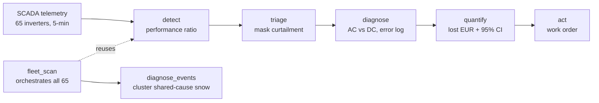

# ENERPARC Reliability Agent

An autonomous agent that sweeps a utility-scale solar fleet, finds the inverters
that have silently stopped producing, proves why (down to AC vs DC side), and
prices the lost energy in euros - then tells you which faults to dispatch a
technician for and which "faults" are just weather it should ignore.

Built for the Energy / AI Hackathon Munich 2026 - ENERPARC open track.

> The AI explains; the physics decides.

## The result

Run against Plant A (Silmersdorf, 1.9 MWp, 65 inverters) over the full data span
**2017-01-01 to 2026-06-01** (about 9 years). All numbers below come from
`outputs/fleet_scan.json` and the frozen demo artifacts - nothing is invented.

- Swept **all 65 inverters**; found **182 sustained-zero outage events** on **33** of them.
- **EUR 15,001 in isolated, confirmed inverter faults** - genuinely recoverable
  (97 events across 26 inverters, ~115,568 kWh).
- **Plus EUR 1,826 across 85 weather events the agent correctly SUPPRESSED**
  (not dispatched) - 10 days when 5+ inverters went dark together (snow / shared cause).
- Detected total across both buckets: EUR 16,827.
- **One incident validated against a real ENERPARC maintenance ticket**
  (INV 01.05.029, 2019). This is a single ground-truth match, **not** a fleet-wide
  accuracy rate.

These are *detected* / *recoverable* / *suppressed* figures, not "savings" - acting
on them is a separate operational decision.

## Demo

The deliverable is a single self-contained HTML page (no build step, no server
required to view the static replay):

```
cd apps/card
python -m http.server 8000
# open http://localhost:8000/index.html
```

- Click **Run investigation** to watch the agent scan the fleet, find INV 01.05.029,
  and reason through the incident step by step.
- Append `?auto=1` (or enable reduced-motion) to jump straight to the final report.
- Serving over http (not `file://`) also enables the optional live chat.

## How it works



- **detect** - computes each inverter's daily Performance Ratio (IEC 61724) and
  compares it to the median of its same-orientation neighbours; a sustained gap is a flag.
- **triage** - masks grid/market curtailment (the plant's DV setpoint signal) so a
  throttle is never scored as a fault.
- **diagnose** - splits AC vs DC failure from the DC rails (U_DC present + I_DC ~ 0 =
  panels alive, inverter dead) and corroborates with the inverter's own error log.
- **quantify** - prices the loss as (expected - actual) x tariff, with a confidence interval.
- **act** - issues a work order with the recommendation and ROI context.
- **fleet_scan** runs that pipeline across all 65 inverters and aggregates every event;
  **diagnose_events** clusters events that start on the same day across many inverters
  (snow / shared cause) so they are separated from isolated, recoverable faults.

## The method

Every euro is estimated **two independent ways**:

1. A **deterministic sibling counterfactual** - expected output = healthy neighbour
   inverters under the same sun; lost = expected - actual.
2. An **XGBoost weather model** - trained on the inverter's own clean days
   (power as a function of irradiance and temperature), then asked "given this
   weather, what should it have produced?"

On the validated 2019 incident the two estimates were **EUR 195** (Bayesian/sibling)
and **EUR 202** (weather ML) - **96.3% agreement**. That 96.3% is two-method
*agreement on one incident*, not a fleet accuracy figure.

Core principle: **the AI explains; the physics decides.** Every discrete decision
(flag, curtailment mask, AC/DC split, euro figure) is rule-based and computed in
Python. The only language model in the system is the optional chat explainer.

## Honest framing

The fleet number is deliberately split into two buckets:

- **Isolated faults (recoverable):** one inverter dark while its neighbours produce -
  a real failure worth a technician. EUR 15,001.
- **Weather-suppressed (correctly ignored):** 5+ inverters going dark on the same day -
  almost always snow or a shared upstream cause, not a per-inverter fault. EUR 1,826,
  flagged and *not* dispatched.

Why the discrimination matters: one dead inverter in July is a dispatch; the whole
array dark in January is snow - stand down. An agent that cannot tell these apart
floods operators with false work orders.

## Tech stack

- **Python** - pandas, numpy, DuckDB (off-disk parquet), XGBoost, optional CausalImpact
  (BSTS); rdtools for soiling/clipping; openpyxl for the plant workbooks.
- **Tests** - pytest (deterministic, range-tolerant).
- **The card** - one self-contained HTML file: IBM Plex type, hand-rolled inline SVG
  (no chart library), all numbers read from JSON.
- **Chat** - optional Groq `llama-3.3-70b-versatile` over the API, with a deterministic
  local fallback that answers from the verified facts when no key/offline. The
  analysis is fully local and deterministic; the chat sends your question to a hosted
  model, so it is not fully on-premise.

## Repository structure

```
ep-reliability-agent/
  apps/card/index.html        self-contained incident + fleet card (the demo)
  apps/card/*.json            frozen data the card renders (agent_run, benchmark, ...)
  src/
    ingest.py                 load monitoring parquet + plant metadata (DuckDB)
    detect.py                 performance ratio, sibling baseline, flagging (IEC 61724)
    curtailment.py            mask grid/market curtailment days (DV signal)
    hero_match.py             match detected outages to real 2019 service tickets
    diagnose.py               cause + AC/DC side + error-log corroboration
    quantify.py               lost kWh + EUR with 95% CI (causalimpact / sibling_sigma)
    expected_power.py         XGBoost weather model - independent loss cross-check
    agent.py                  deterministic LangGraph investigation + replayable trace
    build_facts.py            assemble verified_facts.json (validate-before-show)
    fleet_scan.py             run all 65, aggregate, snow/weather split
    diagnose_events.py        diagnose top events + cluster shared-cause days
    run_slice1.py             pipeline orchestrator -> detection_daily.parquet
    schemas.py                Pydantic V2 boundary models
  tests/                      pytest suite (slices 1-3, expected_power, fleet_scan, diagnose_events)
  demo_frozen/                frozen canonical artifacts (tracked, reproducible)
  outputs/                    generated artifacts (gitignored; regenerate with the pipeline)
  docs/                       ARCHITECTURE notes, RESULTS, RESEARCH_NOTES
  data/                       Plant A data (proprietary to ENERPARC; gitignored)
  ARCHITECTURE.md             technical deep-dive
  requirements.txt
```

## Run it yourself

```
python -m venv .venv && . .venv/bin/activate     # (Windows: .venv\Scripts\activate)
pip install -r requirements.txt

python -m src.run_slice1        # ingest -> detect -> mask -> detection_daily.parquet
python -m src.build_facts       # single-incident diagnose + quantify -> verified_facts.json
python -m src.fleet_scan        # all 65 inverters -> outputs/fleet_scan.json (+ snow/weather split)
python -m src.diagnose_events   # diagnose top events + clusters -> fleet_top_diagnostics.json

pytest -q                       # run the test suite
cd apps/card && python -m http.server 8000   # serve the card
```

The data tree (`data/Plant A (start here)/`) is proprietary to ENERPARC and is not
included in this repository; the pipeline reads the native monitoring parquet from there.

## Data

- Plant A, Silmersdorf - 1.9 MWp, 65 inverters, 5-minute SCADA, 2017-2026.
- Feed-in tariff **EUR 0.115 / kWh**, read from the plant's `feed-in-tarrifs.xlsx`
  (never assumed).
- Inverter error codes (Refu) mapped to their German descriptions from the plant's
  error-code dictionary.

See [ARCHITECTURE.md](ARCHITECTURE.md) for the full data flow and module contracts.
