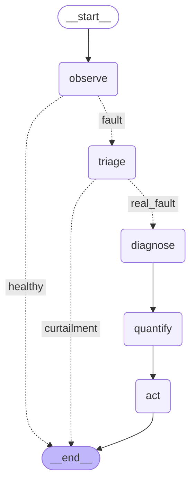

# Architecture

Deterministic pipeline over the existing SCADA feed. Every number is computed in
Python; no model training, no LLM in the engine.

```
Observe -> Detect -> Filter curtailment -> Diagnose -> Quantify -> Act -> Validate
```

## Data contract (module -> input -> output schema)

| Module | Input | Output |
|---|---|---|
| `ingest.load_monitoring` | Plant A native parquet (CSV fallback) | DuckDB views `mon_wide` / `mon_env` / `mon_long` (timestamp, inverter_id, p_ac, i_dc, u_dc) |
| `ingest.load_meta` | `System_Overview.xlsx` | DataFrame[inverter_id, kwp, orientation] |
| `detect.compute_pr` -> `daily_aggregate` -> `sibling_baseline` | mon_* views + meta | daily DataFrame (pr, daily_kwh, dv_frac, insol_kwhm2, sibling_pr, residual, flagged_raw) |
| `curtailment.mask_curtailment` | daily DataFrame | + `reason` ('fault'\|'curtailment'\|'ok'), `flagged` |
| `hero_match.cross_match` | daily + `Tickets.xlsx` | ranked candidates -> `HeroCandidate` |
| `diagnose.diagnose` | monitoring cache + `errorcodes.parquet` + dict | `CauseVerdict` (primary_cause, side, confidence, evidence[], errorcode_corroboration) |
| `quantify.quantify_loss` | `detection_daily.parquet` + `feed-in-tarrifs.xlsx` | `LossEstimate` (lost_kwh, euros + 95% CI, method, pre/post) |
| `build_facts.build_facts` | all of the above | `outputs/verified_facts.json` (after the validate-before-show gate) |

Schemas are Pydantic V2 (`src/schemas.py`, `CauseVerdict`, `LossEstimate`).

## The three differentiators (and the paper behind each)

| Differentiator | Where | Grounded in |
|---|---|---|
| Curtailment masked **before** fault scoring (a throttle is not an outage) | `curtailment.py` + `diagnose` priority-0 guard | DV signal; lesson-from-failure skill (SkillRL, arXiv:2602.08234) |
| Cause with an **AC/DC side split** (tells the technician what to inspect) | `diagnose.py` via I_DC / U_DC | Refu error-log corroboration |
| **Sibling-controlled causal euros with a 95% CI** (not a ratio) | `quantify.py` | Brodersen et al. 2015 (BSTS / CausalImpact) |
| Detections **validated against real service tickets** (precision, not a score) | `hero_match.py` | - |

Soiling and clipping branches call real `rdtools` (`soiling_srr`, Deceglie 2018;
`clip_filter('logic')`, Perry 2021).

## Computation vs narration

Computation lives entirely in Python and lands in `verified_facts.json`. The
planned UI (Slice 4) only *renders* that JSON: `build_facts.assert_facts_consistent`
asserts every emitted number equals its computed source and raises on mismatch,
so no number reaches the narration layer unchecked (validate-before-show,
arXiv:2606.01513).

The planned Slice-3 agent is ReAct-over-tools (Roy et al. 2024, arXiv:2403.04123):
it *acts* on the typed tool outputs (CauseVerdict, LossEstimate), it does not
answer from prose.

## Agent (Slice 3) - deterministic investigation graph

A LangGraph v1.0 StateGraph orchestrates the Slice 1/2 tools into one end-to-end
investigation and writes a typed, replayable trace (outputs/agent_run.json,
consumed by the Slice-4 UI). The decision path is DETERMINISTIC plain Python:
the routing functions read typed tool outputs (sustained-zero-day count,
CauseVerdict.side, curtailment flag) and branch, so every step is auditable and
no LLM can hallucinate the diagnosis. An LLM-routed variant is a one-line swap
(pass an LLM call as the add_conditional_edges path function); we keep routing
deterministic on purpose. The curtailment triage is a lesson-from-failure guard
that terminates the investigation early, never wasting the Bayesian model on a throttle.


